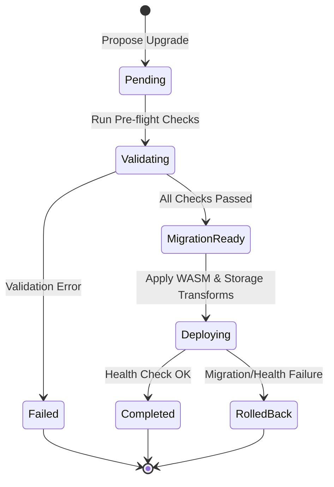

# ADR-0007: Multichain and Contract Upgrade Boundaries in the Backend Service

- **Status:** Accepted
- **Date:** 2026-08-25
- **Deciders:** Core Engineering & Architecture Team
- **Related:** [ADR-0001](./0001-use-soroban-for-smart-contracts.md), [ADR-0002](./0002-off-chain-event-driven-indexing.md), [ADR-0004](./0004-contract-storage-key-layout.md), [ADR-0005](./0005-indexer-relational-schema.md)

---

## Context

As the Scavenger platform expanded beyond single-network Stellar Soroban deployments to support multi-network settlements (Stellar, Ethereum, Polygon, Arbitrum) and automated smart contract migrations, critical architectural boundaries needed to be defined:

1. **Multichain Service Placement**: Should multichain coordination, cross-chain messaging, and network configuration abstraction live in the **Indexer** (`indexer/`) or the **Backend** (`backend/src/services/multichain.rs`)?
2. **Contract Upgrade & Migration Strategy**: How should smart contract code upgrades and storage layout transformations be orchestrated, validated, and safely rolled back when anomalies occur?

In [ADR-0002](./0002-off-chain-event-driven-indexing.md) and [ADR-0005](./0005-indexer-relational-schema.md), the Indexer was explicitly architected as a passive, unidirectional event-ingestion pipeline designed solely to tail ledger events and project them into query-optimized PostgreSQL tables.

However, cross-chain operations require active outbound transaction construction, credential handling, relayer communication, transaction lifecycle polling, and retry policies. Similarly, smart contract upgrades require pre-flight bytecode validation, state schema migration steps, and automated rollback triggers.

---

## Decision

### 1. Multichain Architecture in the Backend

We will implement all multichain abstraction, network routing, and cross-chain transaction orchestration within the **Backend service layer** (`backend/src/services/multichain.rs`), rather than the Indexer:

- **`ChainAbstraction` & Network Registry**: The backend maintains network configurations (`BlockchainNetwork::Stellar`, `Ethereum`, `Polygon`, `Arbitrum`), RPC endpoints, chain IDs, and contract addresses.
- **Cross-Chain Transaction Lifecycle**: Active transaction initiation, cross-chain bridge payload formatting, state tracking (`Pending` -> `Confirmed` / `Failed`), and error handling are managed by backend workers.
- **Indexer Isolation**: The Indexer remains strictly an inbound event-consumer. If secondary blockchains are indexed in the future, dedicated indexer workers will ingest their event streams independently, leaving transaction dispatch and cross-chain orchestration strictly to the backend.

### 2. Contract Upgrade and Rollback Strategy

We will manage Soroban smart contract upgrades through a formalized, stateful lifecycle service in the backend (`backend/src/services/contract_upgrades.rs`):

- **Pre-flight Validation**: Every upgrade must pass automated validation checks before deployment:
  - WASM binary size and compilation sanity.
  - Storage interface and type compatibility.
  - Simulation of state migration against staging ledger forks.
- **Storage Migration Transforms**: Schema migrations define explicit `MigrationStep` operations (`Copy`, `Rename`, `Delete`, `Custom`) to transform existing Soroban persistent storage keys.
- **Deterministic Rollback Plan**:
  - If post-deployment health checks or state migrations fail, the service automatically triggers rollback logic.
  - Rollback reverts contract WASM code hash pointers to the prior approved version.
  - Reversible migration steps are executed to restore prior storage key mappings and state values.

---

## Alternatives Considered

| Alternative | Why it was rejected |
|-------------|---------------------|
| **Multichain orchestration inside the Indexer** | Violates the Indexer's core design as a unidirectional, read-only event projection service. Mixing outbound active transaction dispatch into the indexer would create bi-directional dependencies, complicate error recovery, and increase the indexer's failure domain. |
| **Purely On-Chain Cross-Chain Relaying** | Soroban smart contracts cannot make outbound HTTP/RPC requests directly. While on-chain light clients exist, cross-chain verification on-chain for multiple EVM networks incurs prohibitive gas and storage rent costs compared to backend-coordinated relayer transactions. |
| **Unorchestrated / Manual Contract CLI Upgrades** | Manual deployment via CLI lacks automated pre-flight validation, does not execute structured storage transformations, and provides no reproducible, automated rollback mechanism during incidents. |

---

## Consequences

### Positive

- **Clear Separation of Concerns**: Indexer consumes events; Backend orchestrates business logic, state mutations, and multi-network communication.
- **Robust Disaster Recovery**: Contract upgrades follow a predictable state machine with automated rollback capability, preventing ledger corruption.
- **Pluggable Networks**: Adding a new target chain (e.g. Base, Optimism) only requires extending `BlockchainNetwork` and `ChainAbstraction` without modifying event indexing pipelines.
- **Secure Credential Isolation**: Signing keys and relayer RPC credentials remain isolated in backend secret vaults rather than exposed across all ingestion workers.

### Negative

- **Backend Complexity**: The backend must handle heterogeneous chain RPC APIs, different finality times, and differing transaction fee models.
- **Reversible Transform Constraints**: Migration steps must be designed to be invertible where possible, requiring developers to write inverse migration logic.

### Neutral

- Cross-chain transactions remain subject to external bridge latency and target network confirmation times.
- Both backend and contract upgrade audit logs must be retained for compliance tracing.

---

## Compliance

1. **Service Boundaries**: PRs introducing cross-chain transaction logic or outbound RPC dispatch must place this functionality within `backend/src/services/` and never within `indexer/`.
2. **Upgrade Safety**: Any contract upgrade script or service must implement the `ContractUpgradeService` state transitions (`Validating` -> `MigrationReady` -> `Deploying`) and provide an explicit rollback path before merging.
3. **Indexer Purity**: The Indexer must remain free of outbound transaction mutation logic; it should only ingest event streams and project them to database tables.
