# Stellar Soroban Contract Architecture & Module Map

This document outlines the architectural design, module layout, dependencies, and responsibilities for the Scavenger smart contract located in `stellar-contract/src`.

---

## 1. High-Level Architecture Overview

The Scavenger smart contract on Stellar Soroban implements a decentralized circular-economy waste management, tracking, verification, and incentive platform. The codebase is organized into layered modules separating core types, validation logic, storage optimizations, event emission, domain workflows, and dispatch logic.

```mermaid
graph TD
    subgraph Dispatch_and_Entry ["Contract Entry Point"]
        LIB["lib.rs<br/>(ScavengerContract Dispatcher)"]
    end

    subgraph Domain_Management_Facades ["Domain Management Facades (Issue #925)"]
        ADMIN["admin.rs"]
        PART_MGMT["participant_mgmt.rs"]
        WASTE_MGMT["waste_mgmt.rs"]
        INC_MGMT["incentive_mgmt.rs"]
        XFR_MGMT["transfer_mgmt.rs"]
    end

    subgraph Domain_Logic_and_Validation ["Domain Logic & Helpers"]
        PART["participant.rs"]
        WASTE["waste.rs"]
        INC["incentive.rs"]
        VAL["validation.rs"]
        VERIF["verification.rs"]
    end

    subgraph Infrastructure_and_Services ["Infrastructure & Feature Modules"]
        PART_STORE["participant_storage.rs"]
        BATCH_OPT["batch_optimizer.rs"]
        STORE_OPT["storage_optimizer.rs"]
        STORE_UTILS["storage_utils.rs"]
        QUERY_OPT["query_optimizer.rs"]
        BENCH["benchmark_regression.rs"]
        KEY_ROT["key_rotation.rs"]
        ZKP["zkp.rs"]
        AUDIT["audit_log.rs"]
        EV_BUILDER["event_builder.rs"]
        EVENTS["events.rs"]
        ANALYTICS["analytics.rs"]
        CONT_ANALYTICS["contract_analytics.rs"]
        EXPLORER["explorer.rs"]
        SEARCH["search.rs"]
        UPGRADE["upgrade.rs"]
        VERSION["versioning.rs"]
    end

    subgraph Core_Foundations ["Core Foundations"]
        TYPES["types.rs"]
        ERRORS["errors.rs"]
        TYPE_UTILS["type_utils.rs"]
    end

    %% Dependencies
    LIB --> ADMIN & PART_MGMT & WASTE_MGMT & INC_MGMT & XFR_MGMT
    LIB --> PART & WASTE & INC & VAL & VERIF
    LIB --> PART_STORE & BATCH_OPT & STORE_OPT & STORE_UTILS & QUERY_OPT
    LIB --> BENCH & KEY_ROT & ZKP & AUDIT & EVENTS & EV_BUILDER
    LIB --> ANALYTICS & CONT_ANALYTICS & EXPLORER & SEARCH & UPGRADE & VERSION
    LIB --> TYPES & ERRORS & TYPE_UTILS

    PART_MGMT --> TYPES
    WASTE_MGMT --> TYPES
    INC_MGMT --> TYPES
    XFR_MGMT --> TYPES
    ADMIN --> TYPES

    PART --> TYPES & ERRORS
    WASTE --> TYPES & ERRORS
    INC --> TYPES & ERRORS
    VAL --> ERRORS
    VERIF --> TYPES
    PART_STORE --> TYPES & ERRORS
    BATCH_OPT --> TYPES
    STORE_UTILS --> TYPES
    CONT_ANALYTICS --> TYPES
    EVENTS --> TYPES
    EV_BUILDER --> TYPES
    KEY_ROT --> ERRORS
    ZKP --> ERRORS
    UPGRADE --> TYPES
    TYPE_UTILS --> TYPES
```

---

## 2. Module Responsibilities (Comprehensive Map)

Every source file in `stellar-contract/src/` is categorized below with its one-paragraph responsibility summary:

### 2.1 Core Entry & Dispatch

#### [`lib.rs`](file:///workspaces/Scavenger/stellar-contract/src/lib.rs)
Acts as the central entry point and public interface for the `ScavengerContract`. It defines the contract implementation using Soroban SDK macros (`#[contract]`, `#[contractimpl]`), configures instance and persistent storage key prefixes, implements all externally-callable contract methods, enforces authorization checks, and orchestrates calls across domain helpers, validation logic, storage layers, and event emitters.

---

### 2.2 Core Data Types & Error Definitions

#### [`errors.rs`](file:///workspaces/Scavenger/stellar-contract/src/errors.rs)
Serves as the single source of truth for all typed contract error codes (`#[contracterror] pub enum Error`). It maps numeric `u32` error codes to distinct variants (such as `Unauthorized`, `WasteNotFound`, `InvalidWeight`, and `InsufficientBudget`) used uniformly by all sub-modules, dispatch handlers, and client integration harnesses.

#### [`types.rs`](file:///workspaces/Scavenger/stellar-contract/src/types.rs)
Defines the core data structures, records, and enum representations for the Scavenger ecosystem, including `Waste`, `Participant`, `ParticipantRole`, `Incentive`, `WasteGrade`, `MaterialComposition`, `CarbonListing`, and `Auction`. It also contains mathematical utility functions such as `calculate_impact_score` and `calculate_carbon_credits`.

#### [`type_utils.rs`](file:///workspaces/Scavenger/stellar-contract/src/type_utils.rs)
Provides low-level type optimization utilities and memory footprint estimators for Soroban WASM. It implements `TypeSizes` for XDR serialized size calculations, `PackedFlags` for bit-packing multiple boolean properties into a single `u32`, and `CompressedCoords` for compacting GPS coordinates into a `u64` to minimize on-chain storage costs.

---

### 2.3 Domain Helpers & Validation

#### [`validation.rs`](file:///workspaces/Scavenger/stellar-contract/src/validation.rs)
Consolidates reusable input validation rules and parameter constraints across contract endpoints. It provides boundary guards for GPS coordinates (`validate_coordinates`), waste weights (`validate_weight`), revenue/incentive share percentages (`validate_percentage`), string memo lengths, and distinct address checks.

#### [`participant.rs`](file:///workspaces/Scavenger/stellar-contract/src/participant.rs)
Encapsulates domain logic and business rules for participant records. It provides helper functions for role checks (`can_submit_waste`), GPS coordinate validation, and mathematical derivations of participant reputation tiers (`tier_from_tokens`) and certification levels (`certification_from_weight`) based on lifetime waste processing volumes.

#### [`waste.rs`](file:///workspaces/Scavenger/stellar-contract/src/waste.rs)
Implements business rules and state transition guards for waste batches. It enforces status requirements (`require_active`, `require_not_frozen`, `require_not_expired`, `require_confirmed`), checks allowable transfer routes between roles (Recycler → Collector → Manufacturer), and validates individual item submission weights.

#### [`incentive.rs`](file:///workspaces/Scavenger/stellar-contract/src/incentive.rs)
Manages the domain calculations and constraints for manufacturer incentive programs. It handles creation parameter validation (budget and reward rates), schedule validity checks (`starts_at` and `ends_at` time window enforcement), tiered/flat reward calculations, and in-place budget exhaustion handling during reward claims.

#### [`verification.rs`](file:///workspaces/Scavenger/stellar-contract/src/verification.rs)
Defines data structures and lifecycle state machines for waste verification. It models `VerificationState` (Pending, InProgress, Verified, Failed, Expired), records verifier identities, physical inspection timestamps, test results, and structured workflows for third-party auditing of waste submissions.

---

### 2.4 Domain Management Facades (Issue #925)

#### [`admin.rs`](file:///workspaces/Scavenger/stellar-contract/src/admin.rs)
Provides a domain-scoped facade and type re-exports for administrative capabilities. It documents and groups contract operations related to contract initialization, multi-admin management, pause/unpause safety switches, multisig proposal execution, and global configuration parameter adjustments.

#### [`participant_mgmt.rs`](file:///workspaces/Scavenger/stellar-contract/src/participant_mgmt.rs)
Exposes domain-scoped re-exports for participant types and documents client-facing endpoints for participant registration, profile and location updates, role management, certification tracking, recycling challenges, milestones, and leaderboard ranking queries.

#### [`waste_mgmt.rs`](file:///workspaces/Scavenger/stellar-contract/src/waste_mgmt.rs)
Exposes domain-scoped re-exports for waste data models and lists the contract dispatch methods governing waste registration, batch verification, transfers, splitting, merging, grading, deactivation, and contamination reporting.

#### [`incentive_mgmt.rs`](file:///workspaces/Scavenger/stellar-contract/src/incentive_mgmt.rs)
Exposes domain-scoped re-exports for incentive structures and outlines contract methods for creating, updating, scheduling, querying, and distributing manufacturer incentive reward programs.

#### [`transfer_mgmt.rs`](file:///workspaces/Scavenger/stellar-contract/src/transfer_mgmt.rs)
Exposes domain-scoped re-exports and documents the multi-signature approval and lifecycle workflows for waste transfers, including transfer initiation, recipient acceptance/rejection, high-value transfer thresholds, and expiration deadline sweeps.

---

### 2.5 Storage, Caching & Performance Optimization

#### [`storage_utils.rs`](file:///workspaces/Scavenger/stellar-contract/src/storage_utils.rs)
Implements Soroban Time-To-Live (TTL) state extension helpers to safeguard against ledger archival. It provides `bump_instance` to extend instance storage for 30 days (~518,400 ledgers) on every invocation and `bump_persistent` to extend individual persistent entities for 90 days (~1,555,200 ledgers).

#### [`participant_storage.rs`](file:///workspaces/Scavenger/stellar-contract/src/participant_storage.rs)
Consolidates all low-level participant persistent storage read, write, and index operations into a single module. It maintains the participant index (`PART_IDX`), manages pagination and lookup caching, and enforces consistent key layout patterns across the codebase.

#### [`storage_optimizer.rs`](file:///workspaces/Scavenger/stellar-contract/src/storage_optimizer.rs)
Implements optimization patterns for temporary and persistent storage access. It provides an in-memory/temporary storage cache (`StorageCache`) with custom TTLs to prevent redundant reads during complex transactions, and secondary lookup indexes (`StorageIndex`) for efficient key mappings.

#### [`batch_optimizer.rs`](file:///workspaces/Scavenger/stellar-contract/src/batch_optimizer.rs)
Provides gas-optimized batch execution utilities (`BatchConfig`, `BatchResult`, `BatchParticipantUpdate`, `BatchWasteTransfer`) that group multiple participant balance updates and waste transfers into consolidated read-modify-write cycles to minimize storage operations and transaction fees.

#### [`query_optimizer.rs`](file:///workspaces/Scavenger/stellar-contract/src/query_optimizer.rs)
Implements a rule-based query optimization engine and cost estimator (`QueryPlan`, `QueryOptimizer`). It analyzes query types (such as leaderboard, transfer history, and filtered waste lookups) and generates optimized execution strategies using caching and secondary index hints.

#### [`benchmark_regression.rs`](file:///workspaces/Scavenger/stellar-contract/src/benchmark_regression.rs)
Establishes an on-chain performance baseline tracking and regression detection framework (`MetricType`, `BenchmarkResult`, `BaselineMetrics`). It monitors gas consumption, storage read/write counts, and execution latencies to flag performance regressions when contract functions exceed established baseline thresholds.

---

### 2.6 Events, Audit & Search Services

#### [`events.rs`](file:///workspaces/Scavenger/stellar-contract/src/events.rs)
Defines topic symbols and standardized helper functions for publishing contract events (e.g., `emit_waste_registered`, `emit_waste_transferred`, `emit_participant_registered`, `emit_tokens_rewarded`). It formats payloads into tuples conforming to Soroban's event size and symbol limits.

#### [`event_builder.rs`](file:///workspaces/Scavenger/stellar-contract/src/event_builder.rs)
Implements a fluent builder pattern (`EventBuilder`) for composing and publishing structured Soroban contract events. It defines logical event categories (`EventCategory`), formatters, and filtering utilities to facilitate consumption by off-chain indexers and telemetry pipelines.

#### [`audit_log.rs`](file:///workspaces/Scavenger/stellar-contract/src/audit_log.rs)
Provides an event-driven audit logging service (`AuditLogService`, `AuditLog`, `AuditLogFilter`) for sensitive administrative and state operations. By emitting audit entries as contract events instead of storing expanding vectors in persistent storage, it eliminates persistent storage rent and gas costs while keeping actions indexable off-chain.

#### [`search.rs`](file:///workspaces/Scavenger/stellar-contract/src/search.rs)
Implements an on-chain keyword indexing and relevance search engine (`SearchService`, `SearchResult`, `SearchQuery`). It enables entity indexing and substring relevance matching directly on-chain for lightweight entity discovery.

---

### 2.7 Security, Cryptography & Upgrades

#### [`key_rotation.rs`](file:///workspaces/Scavenger/stellar-contract/src/key_rotation.rs)
Provides versioned cryptographic key storage and rotation for arbitrary 32-byte opaque secrets (e.g., webhook signing keys, API key hashes, ZKP public keys). It supports admin-controlled rotation, versioned queries, and archival lifecycles (`KeyPurpose`, `KeyRecord`, `KeyStatus`).

#### [`zkp.rs`](file:///workspaces/Scavenger/stellar-contract/src/zkp.rs)
Implements a hash-based commitment and reveal scheme (`compute_commitment`, `store_commitment`, `verify_commitment`) using Soroban's native `env.crypto().sha256()` host function. This provides privacy-preserving proof-of-knowledge primitives for off-chain claims without requiring heavyweight zero-knowledge proving systems in WASM.

#### [`upgrade.rs`](file:///workspaces/Scavenger/stellar-contract/src/upgrade.rs)
Defines data structures and state machines for smart contract code upgrades and migrations (`UpgradeProposal`, `UpgradeStatus`, `ProxyState`, `UpgradeHistory`), supporting admin-proposed WASM hash replacements and migration audit records.

#### [`versioning.rs`](file:///workspaces/Scavenger/stellar-contract/src/versioning.rs)
Maintains contract API versioning metadata (`ApiVersion`, `VersionInfo`, `get_version_info`), tracking currently active and deprecated API versions (such as v1 vs v2) and emitting appropriate migration messages.

---

### 2.8 Analytics & Explorer Integration

#### [`analytics.rs`](file:///workspaces/Scavenger/stellar-contract/src/analytics.rs)
Defines structured multi-dimensional analytics reports (`AnalyticsReport`, `AnalyticsEngine`, `AnalyticsDataPoint`, `ReportType`, `CustomQuery`, `AggregationType`) for tracking participant activity, waste processing throughput, incentive efficiency, supply chain bottlenecks, and environmental impact metrics.

#### [`contract_analytics.rs`](file:///workspaces/Scavenger/stellar-contract/src/contract_analytics.rs)
Provides lightweight in-memory and state aggregation helper methods for mutating `GlobalMetrics` and `RecyclingStats` records (e.g., incrementing grade counters, recording waste activations/deactivations, and accumulating tokens and carbon credits).

#### [`explorer.rs`](file:///workspaces/Scavenger/stellar-contract/src/explorer.rs)
Defines blockchain explorer integration models (`TransactionTracker`, `TransactionType`, `TransactionStatus`, `ExplorerConfig`) for recording transaction hashes, initiator addresses, statuses, and formatted Stellar Expert URLs.

---

### 2.9 Internal Test Modules

#### [`test_expiration.rs`](file:///workspaces/Scavenger/stellar-contract/src/test_expiration.rs)
Internal test suite validating waste expiration timestamps, TTL boundaries, and automatic expiration deactivation logic.

#### [`test_grading.rs`](file:///workspaces/Scavenger/stellar-contract/src/test_grading.rs)
Internal test suite validating waste quality grade assessments (Grades A, B, C, D), scoring matrices, and historical grade transitions.

#### [`test_transfer_path_validation.rs`](file:///workspaces/Scavenger/stellar-contract/src/test_transfer_path_validation.rs)
Internal test suite verifying permitted and prohibited transfer paths across participant roles (Recycler, Collector, Manufacturer) and multi-step transfer routes.

---

## 3. Scope Overlap & Cleanup Recommendations

Several modules have overlapping or unclear boundaries resulting from incremental feature extraction. The following areas are flagged for cleanup in follow-up issues:

| Module Pair / Group | Current Overlap | Recommended Action |
|---------------------|-----------------|-------------------|
| **`waste.rs`** vs **`waste_mgmt.rs`** | `waste.rs` contains validation and lifecycle guards, whereas `waste_mgmt.rs` contains only type re-exports and docstrings. | Merge `waste_mgmt.rs` into `waste.rs` or move domain dispatch functions into `waste_mgmt.rs`. |
| **`incentive.rs`** vs **`incentive_mgmt.rs`** | `incentive.rs` contains reward calculations and scheduling guards, while `incentive_mgmt.rs` only re-exports `Incentive`. | Delete `incentive_mgmt.rs` and re-export `Incentive` directly from `incentive.rs`. |
| **`participant.rs`** vs **`participant_mgmt.rs`** vs **`participant_storage.rs`** | Three separate modules handle participant logic: `participant.rs` (tiers/roles), `participant_mgmt.rs` (re-exports), and `participant_storage.rs` (CRUD/indexes). | Eliminate `participant_mgmt.rs`; retain `participant_storage.rs` strictly for storage access and `participant.rs` for business rules. |
| **`events.rs`** vs **`event_builder.rs`** | `events.rs` uses standalone static emit functions while `event_builder.rs` implements a fluent builder pattern. | Refactor `events.rs` to internally use `EventBuilder` or standardize the contract on `event_builder.rs`. |
| **`analytics.rs`** vs **`contract_analytics.rs`** | `analytics.rs` models complex reporting queries while `contract_analytics.rs` updates in-place counter structs (`GlobalMetrics`). | Consolidate into a single `analytics/` sub-package or unify `contract_analytics.rs` helpers into `analytics.rs`. |
| **`search.rs`** & **`explorer.rs`** vs Off-chain Indexer | Both modules perform on-chain string search and transaction history tracking which incur high Soroban storage fees. | Move full-text indexing and transaction tracking off-chain to the TypeScript indexer service; keep only event emissions on-chain. |
| **`validation.rs`** vs Individual Module Validators | `validation.rs` duplicates some weight and coordinate validation checks found in `waste.rs` and `participant.rs`. | Centralize all generic validators in `validation.rs` and have domain modules call `validation.rs` exclusively. |
